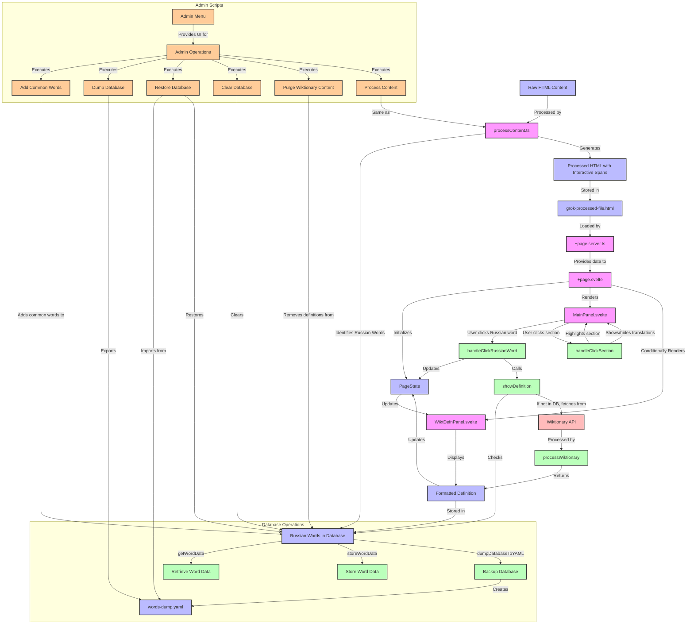

# SPC-Learn: Russian Language Learning Tool


## Information Flow Diagram

The following diagram illustrates how information flows through the application:



## Diagram Explanation

This diagram shows the flow of information through the application:

### Main Flow
- Raw HTML content is processed to identify Russian words and generate interactive HTML
- The processed HTML is loaded by the server and provided to the client
- The client initializes the page state and renders the main components
- When a user clicks on a Russian word, its definition is retrieved and displayed

### Admin Scripts (Orange)
- The admin menu provides a central interface for various administrative operations
- Scripts like `add-common-words.ts` add common Russian words to the database
- Database management scripts allow for backing up, restoring, and clearing the database
- Content processing scripts handle the transformation of raw HTML to interactive content

### Database Operations
- Words and their definitions are stored in and retrieved from the database
- The database can be backed up to a YAML file for version control
- The database can be restored from the YAML backup when needed

## Dev

As the db schema is changing, it's pointless to commit the yaml dump of the db.
When chainging the format of the processed wiktionary page, better clean the db
before running `pnpm run dev`

## HTML and DOM

The raw html file has been produced by grok.
The relevant section for the app are of the form.

```html
 <ol class="marker:text-secondary" start="21">
                  <li class="break-words">
                    <strong>Russian:</strong> Это падение мужества, временами
                    доходящее почти до полного исчезновения, представляет собой
                    не только недостаток воли, но и недостаток духовной силы.<br />
                    <strong>English:</strong> This decline in courage, at times
                    reaching almost a total disappearance, represents not only a
                    lack of will but a lack of spiritual strength.
                  </li>
                  ...
 </ol>
```

The processed html file breaks sentence into words like this.

```html
<span data-lang="ru" data-word="падение">падение</span> 
```

When interacting with the user, style information is added to the dom, to show,
hide or emphasize stuff as seen per a copy of an element from chrome devtools.
Here with the word "это" selected.

```html
<ol class="marker:text-secondary" start="21">
                  <li class="break-words" style="color: rgb(156, 163, 175); border: 1px solid black;">
                    <strong style="display: none;">Russian:</strong> <span data-lang="ru" data-word="это" data-common="true" style="display: inline; color: rgb(238, 0, 0);">Это</span> <span data-lang="ru" data-word="падение" style="display: inline;">падение</span> <span data-lang="ru" data-word="мужества" style="display: inline;">мужества</span>
                    ...
                  </li>
</ol>
```