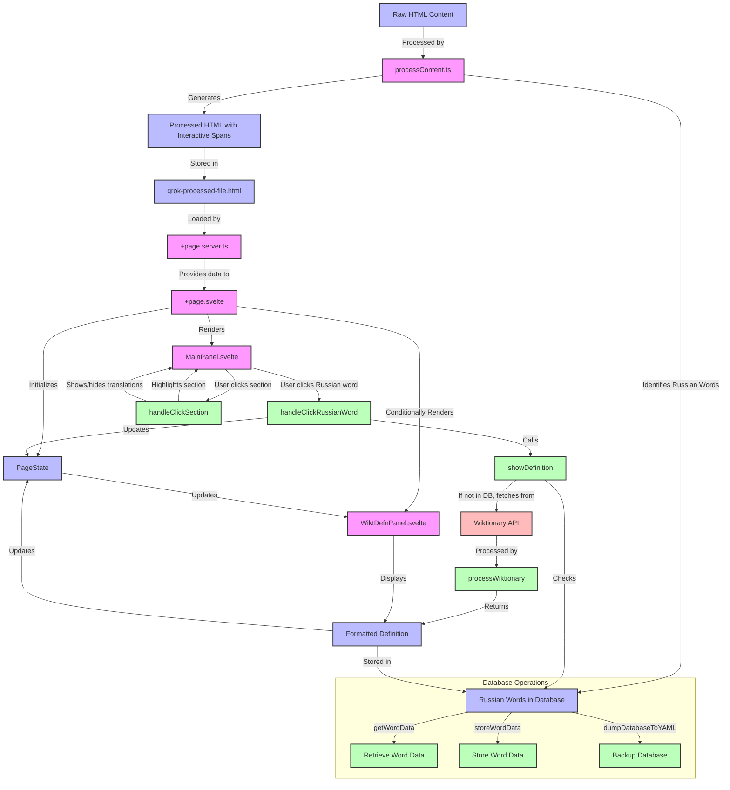

# SPC-Learn: Russian Language Learning Tool

## Information Flow Diagram

The following diagram illustrates how information flows through the application:

```mermaid
graph TD
    %% Main Components
    A[Raw HTML Content] -->|Processed by| B[processContent.ts]
    B -->|Identifies Russian Words| C[Russian Words in Database]
    B -->|Generates| D[Processed HTML with Interactive Spans]
    D -->|Stored in| E[grok-processed-file.html]
    
    %% Server-side Flow
    E -->|Loaded by| F[+page.server.ts]
    F -->|Provides data to| G[+page.svelte]
    
    %% Client-side Flow
    G -->|Initializes| H[PageState]
    G -->|Renders| I[MainPanel.svelte]
    G -->|Conditionally Renders| J[WiktDefnPanel.svelte]
    
    %% User Interaction Flow
    I -->|User clicks Russian word| K[handleClickRussianWord]
    K -->|Updates| H
    K -->|Calls| L[showDefinition]
    
    %% Definition Retrieval Flow
    L -->|Checks| C
    L -->|If not in DB, fetches from| M[Wiktionary API]
    M -->|Processed by| N[processWiktionary]
    N -->|Returns| O[Formatted Definition]
    O -->|Stored in| C
    O -->|Updates| H
    
    %% State Updates
    H -->|Updates| J
    J -->|Displays| O
    
    %% Section Handling
    I -->|User clicks section| P[handleClickSection]
    P -->|Highlights section| I
    P -->|Shows/hides translations| I
    
    %% Database Operations
    subgraph Database Operations
        C -->|getWordData| Q[Retrieve Word Data]
        C -->|storeWordData| R[Store Word Data]
        C -->|dumpDatabaseToYAML| S[Backup Database]
    end
    
    %% Style Definitions
    classDef component fill:#f9f,stroke:#333,stroke-width:2px;
    classDef data fill:#bbf,stroke:#333,stroke-width:2px;
    classDef function fill:#bfb,stroke:#333,stroke-width:2px;
    classDef api fill:#fbb,stroke:#333,stroke-width:2px;
    
    %% Apply Styles
    class A,D,E,O data;
    class B,F,G,I,J component;
    class K,L,N,P,Q,R,S function;
    class M api;
    class C,H data;
```

